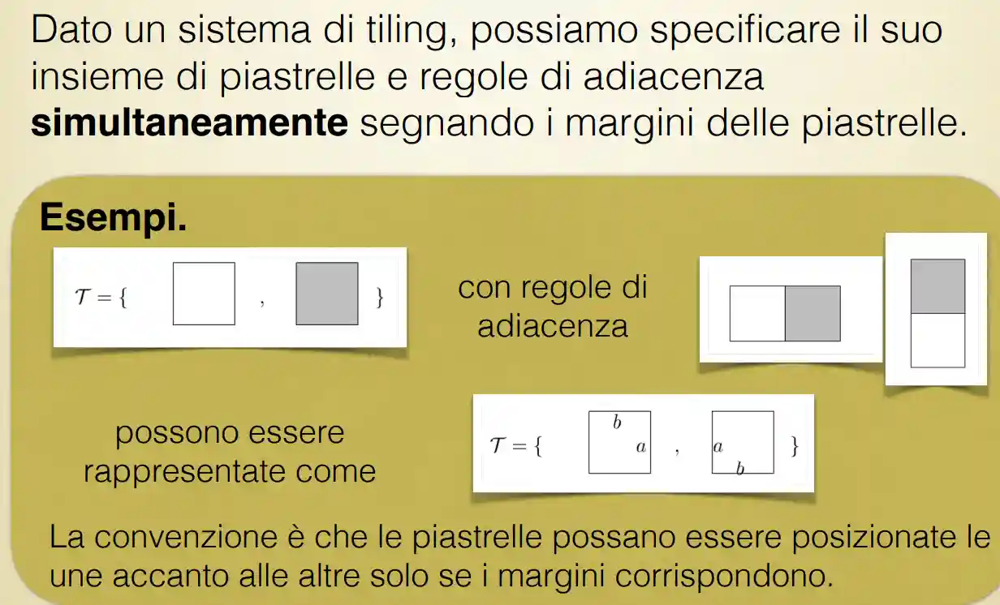
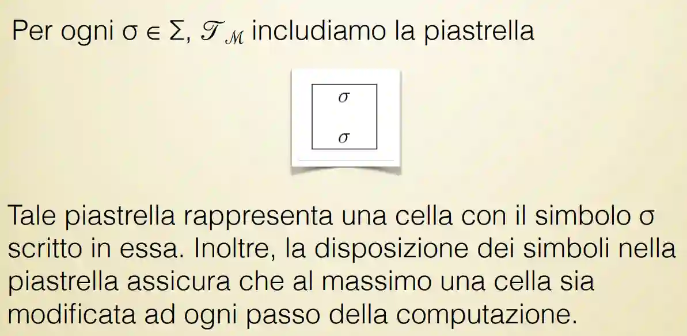
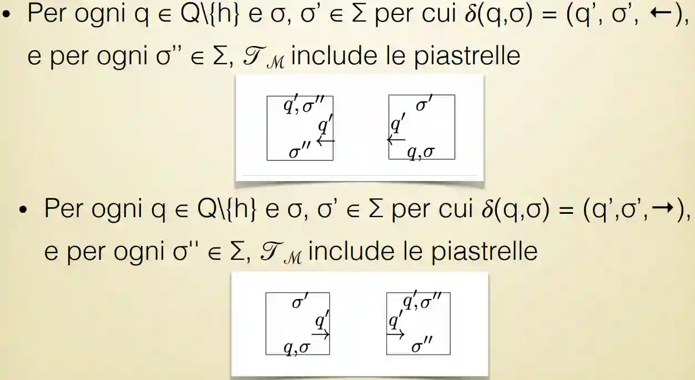
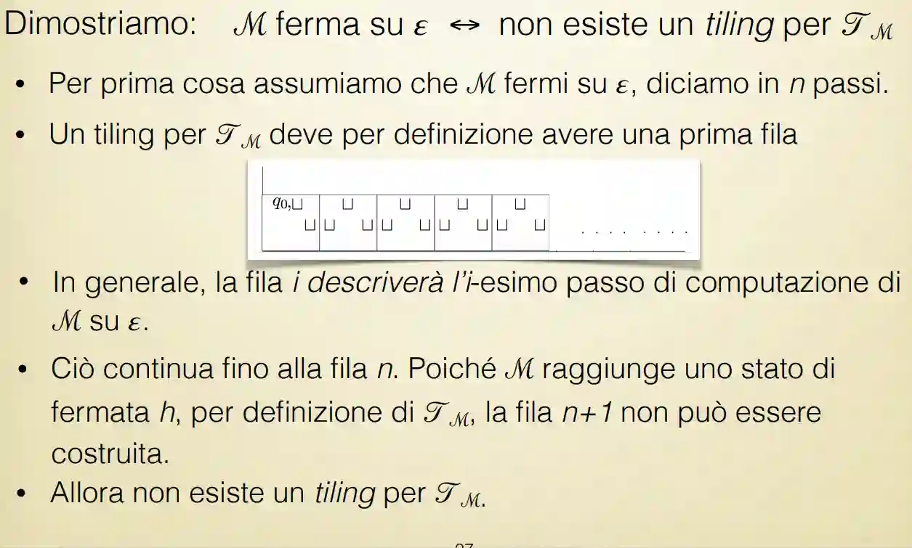

This note is useful to gather in a single place the description of some common problems in CS and their theoretical implications explained in other notes.
## The Clique problem

### Description of the problem

This problem is in NP, find all sub-graphs where all nodes are connected (this set of nodes forms a complete graph).

We can prove that the problem is in NP because there is an easy non-deterministic algorithm that computes it.
See [Time and Space Complexity#Clique problem](./time-and-space-complexity#clique-problem) for details of this proof.

A little more formally:
Given a graph $\langle G, E \rangle$ we say that the solver for the clique problem returns a list of nodes $N \subseteq G$ such that that is a complete graph.
A subset of this problem is when we need cliques of $k$ nodes. So the problem is to return these $k$ nodes if they exist (or just say they don't ).

## The SAT problem

SAT stands for SATisfiability.

### Background notions

#### Boolean formulas
We define a language with variables and their negations. Logical and and or operations.
Then we assign all possible values to the variables and see their end values after passing to the polynomial problem.
But this **explodes** exponentially.
Sometimes the boolean formula is in Logica Proposizionale, another time using Logica del Primo ordine.
#### Third conjunct normal form

If we have only OR operations, that is a *clause*.
Then we say it is in conjunct normal form if these clauses are linked with AND operations.
It's *third* when the clauses have exactly tree variables.

#### Why is this problem important
Many historical approaches used this problem to think about satisfiability. This problem is also important in constraint programming.
TODO: add links in the future when it happens.

### Definition of 3-SAT problem

Given a third conjunct normal form, find assignments such that it satisfies the boolean formula.

### 3-SAT $\leq_{P}$  CLIQUE
We prove using the notion of [Cook-Levin and Savitch#Poly-reduction](./cook-levin-and-savitch#poly-reduction) that 3-sat is reducible polynomially to clique.

In order to do this we need to transform the problem into graph format, and graph format to assignments.

#### Conversion strategy🟩
For every clause we defines 3 nodes.
Then we link every node in this way:
1. If in same clause, don't link
2. If in other link, link only if it's not your negation.

Example:

We can prove that this conversion is polynomial (clear, you can write the algo and prove it 💠).

#### Why does the conversion work?
Now, if the 3-SAT formula is satisfiable, then at least one node for each clause is true. We select a single true node for each clause, and this brings us the clique.
By construction, this is a complete sub-graph. So this reduction works. Why does it work? Because as we have $k$ clauses, we have selected a node from each clause, and we know that each node is connected to each other node, because if not that wouldn't be satisfied (by construction there is a link with other node $\iff$ the node is in other triplet $\land$ it's not himself negated).

We now have a graph, let's suppose we have a clique, then the 3-SAT is satisfiable because of similar arguments above (just assign true to those variables).

## True quantified Boolean formula
Also called TQBF, it is defines as follows:

$$
TQBF = \left\{ \langle F \rangle \mid F \text{ is a true boolean statement } \right\} 
$$
Where statement is a boolean formula were the values are all bounded.
This problem is important for [Time and Space Complexity](./time-and-space-complexity) analysis.

### TQBF is PSPACE-complete
Remember that a problem is PSPACE complete if it is in PSPACE and every other PSPACE languages can be poly-reduced to this language.

#### TQBF is in PSPACE
This technique is something similar to Sintassi e RI strutturali technique.
1. If there are no quantifiers, evaluate the statements, and if it is true accept, else reject.
2. If we have a format like $F = \exists x.G$ Then enumerate all: evaluate the truthfulness given $x = 1$, and then with $x = 0$ if one of them is true then return true.
3. If we have a format like $F = \forall x. G$ then evaluate both $x= 1$ and $x = 0$ and if both true return true.
This is a recursive algorithm, and it is $O(m)$ where $m$ are the terms (max $m$ recursive passes, every recursive pass has at most a single term memorized). $\square$.

#### TQBF is PSPACE-hard
This is difficult to grasp. Go to see [(Sipser 2012)](https://books.google.it/books/about/Introduction_to_the_Theory_of_Computatio.html?id=P3f6CAAAQBAJ) Chapter 8.3 pp. 340.

The idea is to convert the computation of the TM that decides the given language $L$ using some formulas like $\phi_{c_{1}, c_{2}, t}$ which means that this is true if it's possible to go from $c_{1}$ to $c_{2}$ in at most $t$ steps.
In this setting $c_{1}$ and $c_{2}$ are different configurations of the Turing Machine.

The proof is by induction:
1. If $t=1$ then $c_{1}=c_{2}$ or it's possible to go into $c_{2}$ using a single step. This is verifiable using the windows argument in the [Cook-Levin theorem](./cook-levin-and-savitch#cook-levin-theorem).
Else it's a little bit more difficult.
It's easy to verify it 🤠.
$$
F_{c, c', t} = \exists m_{1} \forall(c_{3}, c_{4}) \in \left\{ (c, m_{1}), (m_{1}, c') \right\} F_{c_{3}, c_{4}, \frac{t}{2}}
$$
Given this inductive formulation, we can observe that we add only $O(n^{k})$ quantifiers in the recursive proof. So the formula has $\log (2^{dn^{k}})$ induction steps which is $O(n^{k})$. So this problem is PSPACE-hard.

### Two player games
It is possible to prove that every two player zero-sum game like chess or Go, that uses a minimax tree search strategy can be expressed into a TQBF problem like this (informally):
For every move of the opponent, exists one of my moves such that for every move of the opponent .... -> I win.
This is a TQBF statement.

## The Tiling Problem
### Formalizzazione del problema
#### Definizione formale del tiling

Consideriamo una tupla $\langle \mathcal{T}, t_{0}, H, V \rangle$
1. $\mathcal{T}$ è un insieme di piastrelle.
2. $t_{0} \in \mathcal{T}$ è la piastrella d'origine.
3. $H \subseteq \mathcal{T} \times \mathcal{T}$ le regole di adiacenza orizzontali.
4. $V \subseteq \mathcal{T} \times \mathcal{T}$ le regole di adiacenza verticali.

L'obiettivo è vedere se è possibile riempire tutto il piano con queste piastrelle, all'infinito. Sappiamo già che non è sempre possibile farlo. Ci chiediamo se è automatizzabile. Questo problema è stato risolto nel 1966, e sembra non essere riconoscibile nemmeno.

Ossia in matematichese definire la funzione
$f : \mathbb{N} \times \mathbb{N} \to \mathcal{T}$
Con 
1. $f(1, 1) = t_{0}$
2. $\forall n,m \in \mathbb{N}, (f(n, m), f(n + 1, m)) \in V$
3. $\forall n,m \in \mathbb{N}, (f(n, m), f(n, m+1)) \in H$

#### Strategia di dimostrazione
Vogliamo ridurlo da $ETH^{-}$ che abbiamo spiegato in [Halting Theorem and Reducibility](./halting-theorem-and-reducibility).
Questo è un linguaggio non riconoscibile, perché il suo complemento è riconoscibile in modo banale.

Questa dimostrazione avrà un sacco di punti molto tecnici per dire che una macchina di turing deve essere tradotta in un problema di tiling...

### Dimostrazione irriconoscibilità del tiling
L'idea principale è che con un tiling posso **simulare l'esecuzione** di una macchina di Turing.
E in questo modo riduco il problema a un Halt. Perché sapere tassellare significa sapere dire quando una macchina di Turing finisce.

#### Codifica delle regole dei tiling
Posso codificare sia i tile disponibili, sia le regole di adiacenza in questo modo.

Poi vogliamo codificare ogni casella verticale **un singolo step di computazione**.

#### Cella di identità
Questa cella non fa niente.

#### Celle di transizione
Possiamo codificare le funzioni di transizione della macchina di Turing.
Poi ho ancora le cose che mantengono il simbolo nella cella di arrivo.

"

#### Conclusione
sse non si ferma la macchina, allora esiste un tiling (che è una cosa banale perché significa che continua all'infinito, e quindi posso mappare tutto).

# References

[1] Sipser [“Introduction to the Theory of Computation”](https://books.google.it/books/about/Introduction_to_the_Theory_of_Computatio.html?id=P3f6CAAAQBAJ) Cengage Learning 2012
